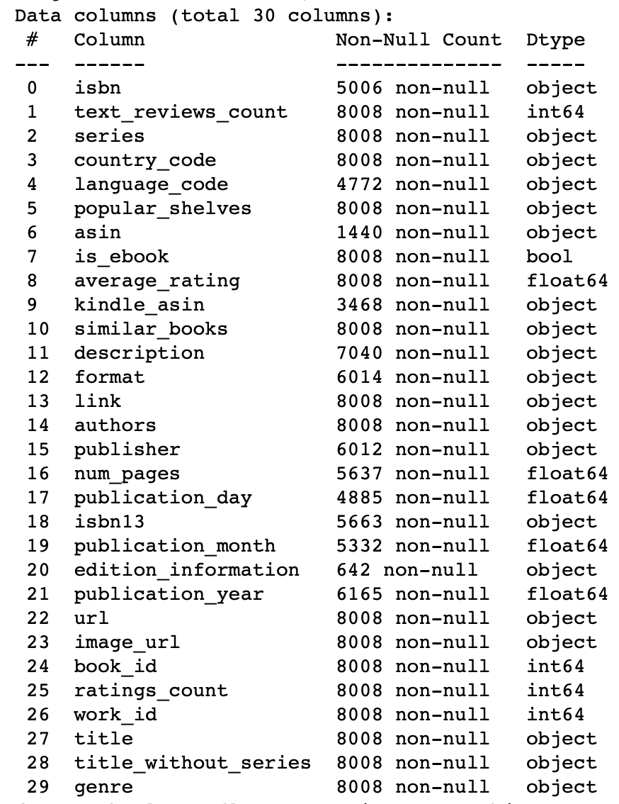
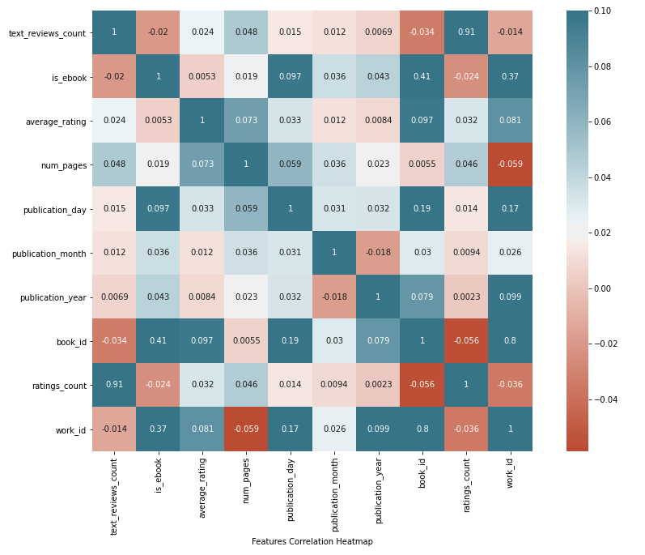
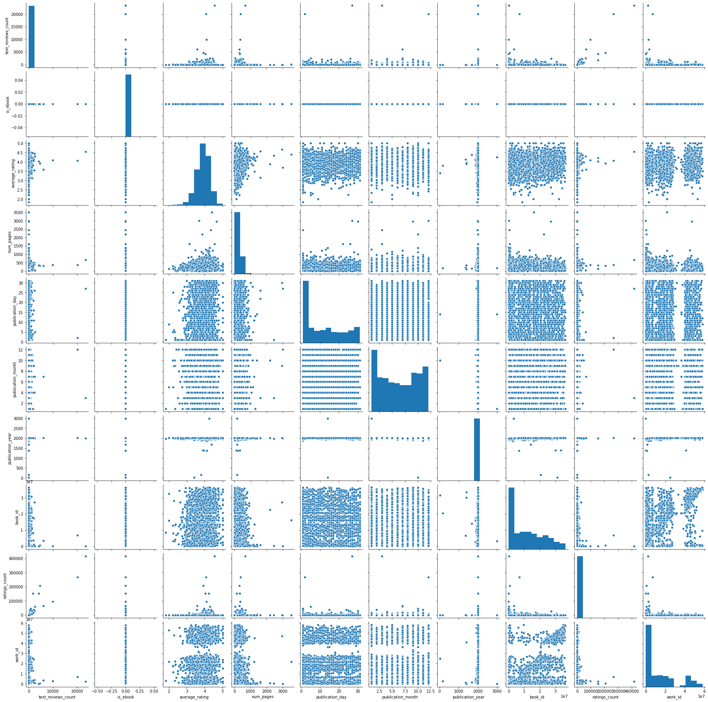
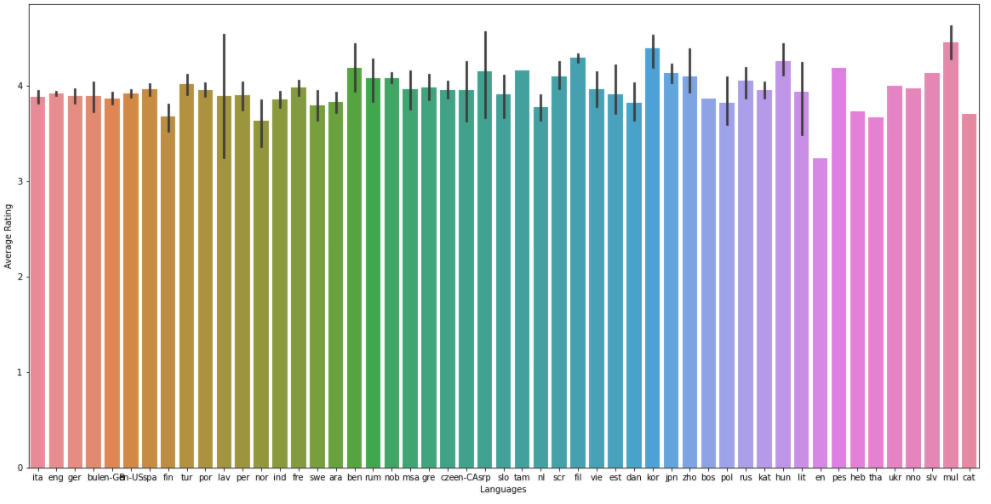
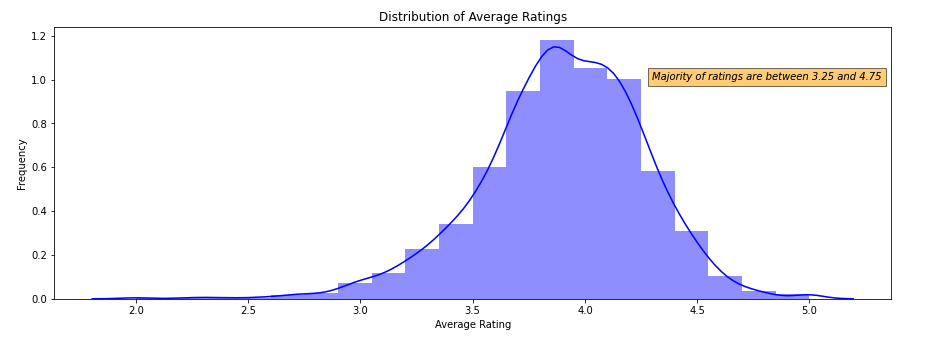
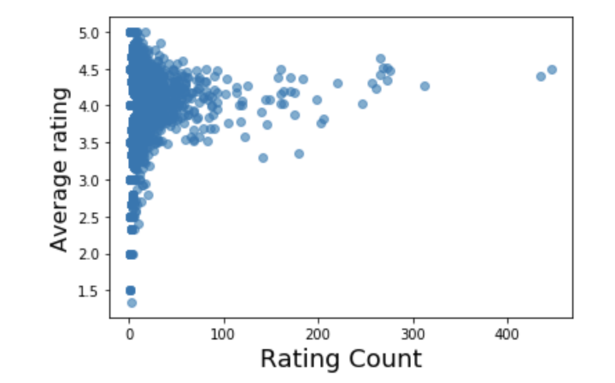
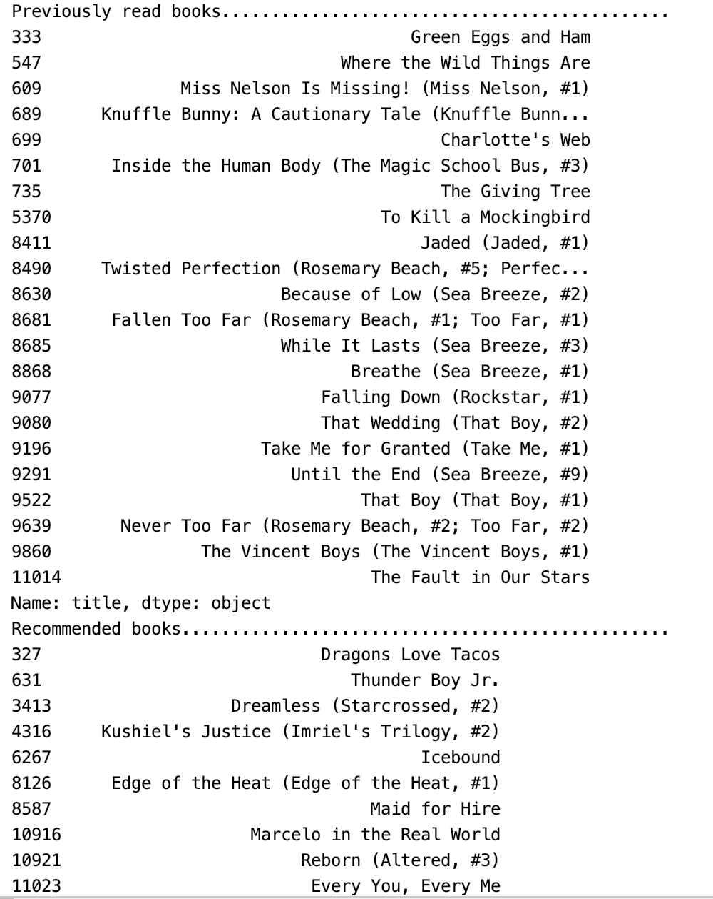

# Book Recommendation System

## Introduction and Background
Goodreads is a social cataloging website where users can review books, maintain their libraries, and generate polls, blogs, and surveys. The purpose of this project is to build a recommendation system for Goodreads that helps users find the perfect book to read. This task can be broken down into two parts: Predicting a book’s rating based on certain attributes and recommending books based on a user’s prior interaction and ratings. Recommender systems employ different approaches such as collaborative filtering, content-based filtering, a hybrid of both, or knowledge-based systems to generate recommendations for a user. Predicting the rating of a book employs supervised techniques such as Linear Regression and Neural Networks.
 

## Problem Definition
We have a set of books *B* with attributes of each book like description, author, number of pages and so on. We also have an interaction matrix *I*, where *I*[*u*][*b*] entry tells what rating user u gave to book *b*. Using these two sets of information we aim to solve the following tasks.
- Given a book *b* with its attributes, predict it's average rating in the range of 0 to 5.
- Given a user's prior interaction with the books i.e. *I*[*u*], suggest top *n* recommendations for that user.

## Dataset
For our project, we will be using a [Goodreads dataset](https://sites.google.com/eng.ucsd.edu/ucsdbookgraph/home)  released by UCSD that was collected in late 2017 by scraping data off of the public shelves of users. The main dataset has data of about 2,300,000 books and 900,000 users. The books are divided into different genres such as Children, Young Adult, Comics, Fantasy, History, etc. Since the original dataset is very large, we will be using a subset of books from each genre dataset. For recommendations, we will be using the user-book interaction dataset, which contains information such as user ID, book ID, rating score, and book review.

## Supervised Task - Predicting average rating of a book

### Data Collection
We used the Goodreads dataset, which was collected from goodreads.com in 2017. This dataset consisted of csv files for different genres and had information about the author, title, rating, reviews, publications details. We read each csv file and added a new column to account for the genre. We then selected 1000 books from each genre and combined all the individual dataframes into one csv file consisting of 8000 books.

### Feature Selection

The dataset provided us with 30 columns which covered a comprehensive range of information such as basic information (title, author, rating, etc.), meta information (isbn, edition information, kindle identifier, format, etc.). The following table lists all the information the dataset provides, along with the data type in which the information is available to us. 

 
*Figure 1: Table of all features*

We want to find the relevant features that affect the target variable (average rating) and need to be included in the model. From these 30 columns, it is easy to identify and remove some of the obvious columns which are not necessary (such as urls, image links, work_id, edition information, etc.) from the data because these columns do not help us predict the average rating of the book. We chose to draw a heatmap for the numerical features of the dataset to find a strong positive or a strong negative correlation between features, especially if any feature had a strong/weak correlation with average rating. We plot this heatmap. Based on the heatmap shown, we decided the average rating did not correlate with any of the numerical columns. So, we decided to focus on the features such as Author and Genre, and then we included more features that either existed in the dataset (e.g. number of pages) or were synthesized (e.g. a ranked ordering of the books based on language of the book). 

 
*Figure 2: Heatmap of correlation between numerical features*

 
*Figure 3: Plot of correlation between numerical features*

One of the features we explored was language code. We essentially wanted to find the spread of books across different languages.
This was the spread for the books across different languages - English - 77.2%, English-US - 12.4 %, Spanish - 3.1%, English-GB - 2.5%, German - 1.7% and Others - 3.1%. Although the dataset contains 51 languages, we see that the top 5 languages cover well over 95% of all the books in it. Our reduced dataset covered this spread and did not keep only books in certain languages. We plot a diagram for Languages vs the Average Rating for the books. We found that for the dataset, using the languages features did not give any marginal improvement in the regression model.

 
*Figure 4: Distribution of Average Ratings across languages*

After choosing the relevant features, we removed data points that were incomplete (NaNs)  We also removed any outliers from these features, for example, the number of pages, any entries greater than 1000 were removed, as they were beyond the third quartile, which we checked using a boxplot. This resulted in 5331 unique data points which were used in the models described below. We visualized the data by looking at the distribution of ratings for these data points as shown in the figure below.

 
*Figure 5: Distribution of Ratings*

 
### Methods

1. **Linear Regression** 
Based on the correlation values observed during the feature selection task, we chose author name, number of pages, genre, and the age of the book as features for training our linear regression model. The age of the book was calculated as (2020 - publication year). To convert the textual features like genre and author name into numerical features so that a model could be trained on them, we used the label encoder from scikit-learn.  After this, we made a train-test split of 80%-20%, and then trained the linear regression model on the data using scikit-learn. The performance observed is showed in the results section.

2. **Neural Network** 
For the neural network implementation, we chose the same features (author name, number of pages, genre, and the age of the book) as features for training our pytorch neural network model. The age of the book was calculated as (2020 - publication year). To convert the textual features like genre and author name into numerical features so that a model could be trained on them, we used the label encoder from scikit-learn to get a one-hot encoding of all the authors and genres. We also normalized the age and number of pages to be between 0 and 1 for both categories. This created 4395 input parameters total. After this, we made a train-test split of 90%-10%, and then trained the neural network with two hidden layers, the first with 300 hidden nodes, and the second with 100 hidden nodes, using ReLU for our activation function. The last layer was a linear layer from the 100 hidden nodes in order to create one rating calculation. For our hyperparameters, we used gradient descent instead of stochastic gradient descent, with our learning rate=0.01 and 100 epochs. The performance observed is given below.
 

### Results
All the metrics resulted are evaluated on the test set.

| Model      | MAE | MSE | RMSE | R-Square |
| ----------- | ------- | ------- | ------- | ------- |
| Linear Regression |  0.275 | 0.127  | 0.356  | 0.818 |
| Neural Network |  0.291 | 0.145| 0.381 | 

### Discussion

Based on the tables shown above, we can see that the linear regression model is able to perform slightly better in terms of the RMSE. RMSE values close 0.35 is not bad considering the range of values for the possible rating (1-5). Moreover, the neural network we implemented was basic (1 hidden layer with limited number of hidden nodes). After the midterm report, we took a more in-depth look on improving the performance of our neural network system. We tried different neural network structures with varying number of layers between 2-4 hidden layers. We also added more parameters, including is_ebook (a boolean) and square root of age and square root of number of pages. We also tuned the learning hyperparameter alpha and the total number of training epochs. Doing all these things resulted in an improvement in our Root Mean Squared Error Metric from 0.381 to 0.339.

## Unsupervised Task - Recommendation System
For the task of recommending books to users, we experimented with following two paradigms.
### Data Collection
For the purpose of recommendations, we use the interactions dataset of the above mentioned dataset. It contains the information how each user rated the book they read. After reducing the size of the dataset and performing some cleaning, we have in total 1000 users and 11122 books. We then did a 80:20 split on this dataset for evaluation. The following plot shows the distribution of average rating across number of ratings received for a book.

### Methods   
1. **Content Based** 
 In content-based filtering, we recommend new books based on user's previously read books. For this, we construct a TF-IDF matrix of size B x W where B is the number of books and W is number of words. From there, we compute a similarity factor
between books x and y using cosine similarity. We then use these similarities to predict ratings of unread book according to the following formula and recommend them according to the predicted ratings.

 

2. **Collaborative Filtering** 
Collaborative filtering makes recommendations based on other users’ ratings along with the user in question. We decided to use Matrix Factorization to build a map of the user and the item (books in our case). One popular method to perform matrix factorization is SVD. However, SVD is best suited to handle incomplete data in the user-rating matrix. Therefore, we decided to use an alternative approach called Alternating Least square (ALS).  We first split the data into training and test sets, with the user_id, book_id, and rating as the features. We performed hyperparameter tuning on the following parameters to the ALS model: rank, max iterations, and regularization). We performed 5 fold cross validation using this parameter grid and fitted the model on the training data. The ALS model was then used to predict the ratings for books for each user in the test set (these books were assumed to be unread to evaluate the performance of the algorithm). The table in the result section displays the performance of our algorithm

### Results
We used Average RMSE as an evaluation metric, average acrossed users. The reason for this is that the dataset is too sparse to get meaningful recall and precision values. Therefore, we chose RMSE for empirical evaluation and we will show qualitative results further below.

| Model      | Avergae RMSE |
| ----------- | ------- |
| Content-based filtering |  0.78 |
| Collaborative filtering |  1.03 | 

Following figure illustrates recommended books for one of our users.

### Discussion
Based on the above results, we can see that content-based filtering performs better compared to collaborative filtering. This points to the case that for book recommendation previously read books are a stronger indicator than similar users. Also, we only have a 1000 users and since collaborative filtering relies on user book interactions, the data might not be sufficient to achieve good results. 

Following figure illustrates recommended books for one of our users using content-based filtering. We can observe from user's previously read books that the user is interested in children, fantasy and romance genre. The recommended books are indeed from the same genre with elements from read books. We could also recommend for each genre in future to make better recommendations. 

## References

[1] Hsu PY., Shen YH., Xie XA. (2014) Predicting Movies User Ratings with Imdb Attributes. In: Miao D., Pedrycz W., Ślȩzak D., Peters G., Hu Q., Wang R. (eds) Rough Sets and Knowledge Technology. RSKT 2014. Lecture Notes in Computer Science, vol 8818. Springer, Cham.   
[2] Logé, C., Yoffe, A., & ceciloge Building the optimal Book Recommender and measuring the role of Book Covers in predicting user ratings. 
[3] Mengting Wan, Julian McAuley, "Item Recommendation on Monotonic Behavior Chains", in RecSys'18. 
[4] Mengting Wan, Rishabh Misra, Ndapa Nakashole, Julian McAuley, "Fine-Grained Spoiler Detection from Large-Scale Review Corpora", in ACL'19.
